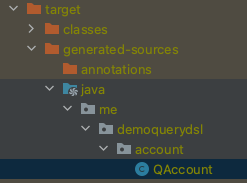

# QueryDSL (Query Domain Specific Language)
쿼리를 자바 코드로 표현하는 방법.
<pre>
List❮Person❯ persons = queryFactory.selectFrom(person)
  .where(
    person.firstName.eq("John"),
    person.lastName.eq("Doe"))
  .fetch();
</pre>
http://www.querydsl.com
   

## QueryDSL 의존성 추가
http://www.querydsl.com/static/querydsl/4.4.0/reference/html_single/#d0e137
<pre>
❮dependencies❯
    ...
    ❮!-- apt 모듈: 코드를 생성해주는 모듈.
           QueryDSL이 우리가 만든 엔티티(모델)를 보고 그 모델에 맞는
           쿼리용 Domain Specific Language를 만들어준다. --❯
    ❮dependency❯
        ❮groupId❯com.querydsl❮/groupId❯
        ❮artifactId❯querydsl-apt❮/artifactId❯
        ❮!-- QueryDSL은 스프링부트가 의존성을 관리해준다.
                그래서 따로 버전을 명시하지 않아도 된다. --❯
        ❮!--❮version❯${querydsl.version}❮/version❯--❯
    ❮/dependency❯
    
    ❮dependency❯
        ❮groupId❯com.querydsl❮/groupId❯
        ❮artifactId❯querydsl-jpa❮/artifactId❯
    ❮/dependency❯
    ...
❮/dependencies❯

❮build❯
    ❮plugins❯
        ❮plugin❯
            ❮groupId❯org.springframework.boot❮/groupId❯
            ❮artifactId❯spring-boot-maven-plugin❮/artifactId❯
        ❮/plugin❯

        ❮!-- QueryDSL을 설정하기 위해 플로그인도 추가해준다. --❯
        ❮plugin❯
            ❮groupId❯com.mysema.maven❮/groupId❯
            ❮artifactId❯apt-maven-plugin❮/artifactId❯
            ❮version❯1.1.3❮/version❯
            ❮executions❯
                ❮execution❯
                    ❮goals❯
                        ❮goal❯process❮/goal❯
                    ❮/goals❯
                    ❮configuration❯
                        ❮outputDirectory❯target/generated-sources/java❮/outputDirectory❯
                        ❮processor❯com.querydsl.apt.jpa.JPAAnnotationProcessor❮/processor❯
                    ❮/configuration❯
                ❮/execution❯
            ❮/executions❯
        ❮/plugin❯

    ❮/plugins❯
❮/build❯
</pre>
의존성을 추가한 후 메이븐에서 compile을 실행하면 'target/generated-sources/java' 경로에  
Account 엔티티에 대한 Query Language(QAccount)를 만들어 준다.   
  
그리고 Repository에서 QuerydslPredicateExecutor를 상속받도록 해준다.  
그럼 QuerydslPredicateExecutor가 제공하는 메소드들을 사용할 수 있게 된다. 
<pre>
public interface AccountRepository 
    extends JpaRepository❮Account, Long❯, QuerydslPredicateExecutor❮Account❯ {
}
</pre>
<pre>
@DataJpaTest
class AccountRepositoryTest {

    @Autowired
    AccountRepository accountRepository;

    @Test
    public void crud() {
        QAccount account = QAccount.account;
        Predicate predicate = account
                .firstName.containsIgnoreCase("Erlend")
                .and(account.lasName.startsWith("Oye"));
        Optional❮Account❯ one = accountRepository.findOne(predicate);
        assertThat(one).isEmpty();
    }

}
</pre>
    

